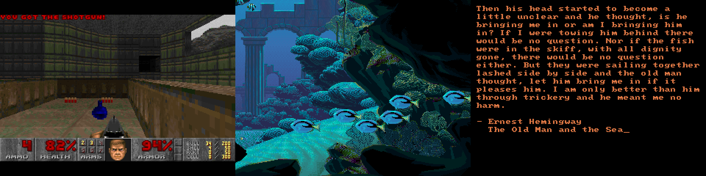

# Minaret
> Experimental MINA32 CPU

Minaret is an experimental softcore CPU and lightweight system-on-chip based on subset of the [MINA instruction set architecture](https://github.com/ladystarbreeze/mina-isa/blob/main/MINA_Instruction_Set_Architecture.md). It is designed for use on FPGAs both by itself and as part of a larger system. Minaret also serves as a demo system for the [MINA32 toolchain](https://github.com/CQCumbers/mina32-llvm) and as a reference for people designing more powerful and complete CPUs for this ISA. Personally, it's a way to explore hardware design, learn about the low-level foundations of computing, and test my MINA32 software on a real system.

The CPU is a multi-cycle implementation that prioritizes readability at the expense of size and speed. Most user mode instructions are supported, while supervisor behaviors like interrupts, syscalls, and fault handling are not. Instruction fetching and data access use seperate 32-bit busses, both with a simple valid/ready interface similar to that of [PicoRV32](https://github.com/cliffordwolf/picorv32#picorv32-native-memory-interface). The core itself is written in platform-independent Verilog and tested using a partial port of [riscv-formal](https://github.com/SymbioticEDA/riscv-formal). The rest of the system-on-chip is designed around the [Arrow DECA](https://tomverbeure.github.io/2021/04/23/Arrow-DECA-FPGA-board.html), a MAX10 development board with builtin DDR3 memory and an HDMI port. Accordingly, the SoC is designed to include a DDR3 controller and direct-mapped cache, as well as a display controller, keyboard controller, timer, and UART interface. These peripherals make use of Quartus and MAX10-specific code, and have only been tested on the DECA. The linker script and bootloader, as well as support functions for the peripherals, are included along with example programs exercising them. An instruction-level simulator with extensive debugger support can help with writing your own software.

## Screenshots

*From left to right: Doom, Coral, and Writer demo screenshots. Coral art by Mark Ferrari.*

## Todo List
- Cleanup RTL files
- Distribute prebuilt toolchain

## Build
Building the example system requires an Arrow DECA board and a copy of Quartus - just open `rtl/quartus/minaret_test.qpf` and program the FPGA over micro USB. The project includes a prebuilt UART bootloader ROM, which will request an intel hex file with your main program image. This hex file can be generated by running `llvm-objcopy -O ihex <ELF> <HEX>` on the ELF binary created by clang (See `sw/hello/Makefile` for more details). Once the hex file is generated, it can be loaded using an FTDI UART cable and `sw/load_hex.py`. The simulator does not require a bootloader, and takes ELF files directly.

For building software, Minaret uses a completely LLVM based cross-compilation toolchain, with newlib as the preferred standard library. To get started, you will need custom copies of [LLVM](https://github.com/CQCumbers/mina32-llvm) and [newlib](https://github.com/CQCumbers/mina32-newlib). See `sw/notes.txt` for MINA32 specific build information.

## Memory Map
This section summarizes the top level SoC architecture implemented in `rtl/minaret_test.v`. Addresses for each peripheral are provided below, but most software access should be through the utility functions in `sw/common/minaret.c`. If you need more details on how to use a peripheral, reading the demo programs might help. For example, `sw/writer` exercises the keyboard interface, while `sw/coral` tests the display controller. The C code in `sim/simulator.c` may also be easier to understand than the Verilog implementation.

| Region   | Base Address | Size        | Attributes |
|----------|--------------|-------------|------------|
| DRAM     | `0x00000000` | 512 MiB     | `r/w/x`    |
| BRAM     | `0x80000000` | 77824 bytes | `r/w/x`    |
| UART     | `0xffffff00` | 16 bytes    | `r/w`      |
| Keyboard | `0xffffff10` | 16 bytes    | `r`        |
| Timer    | `0xffffff20` | 16 bytes    | `r`        |

### DRAM
This region is used for all user program code and data, and is backed by the DDR3 chip built into the Arrow DECA. All access is mediated by a 128 KiB direct-mapped unified cache, consisting of 1024 128-byte cache lines. The cache reduces instruction fetch and data access latency to ~3 cycles when hit, and simplifies the DDR3 controller by only requiring 128-byte memory access. The DDR3 controller is not pipelined, and has ~15 cycles of access latency with spikes when a refresh is needed. See `rtl/cache.v` and `rtl/dram.v` for details.

### BRAM
This region doubles as both video memory and bootrom, and is backed by memory blocks embedded in the FPGA. Being dual-ported, it can handle simultaneous access by the CPU and display controller with constant 1 cycle latency. On startup BRAM is occupied by the bootloader, but after execution jumps to user code in DRAM it's used as a 256 entry 32bpp palette followed by a 320x240 paletted framebuffer. The display controller constantly reads this framebuffer, generates a 640x480 60Hz VGA signal, and sends it to the DECA's ADV7513 HDMI transmitter, which creates the HDMI signal for display. See `rtl/display.v` for details. 

### UART
The UART interface allows Minaret to communicate with other devices via a 115200 baud 8-N-1 serial transmitter and receiver. All addresses in the UART region are handled the same way. On reads, if a character is available in the receive FIFO, bit 15 is set and the character is returned in bits [7:0]. If no character is available, bit 15 is not set, and bits [7:0] are undefined. On writes, bits [7:0] are immediately transmitted, and the memory interface stalls until the transmission is complete. User code is sent to the bootloader via this interface. See `rtl/uart.v` for details. Physically, this interface makes use of pins 0/4/6/8 on the P8 header as GND/VCC/TX/RX.

### Keyboard
The keyboard interface allows programs to read keyboard data from over a PS/2 connection. On reads, if an event is available in the FIFO, bit 15 is set and the keycode is returned in bits [8:0]. If no event is available, bit 15 is not set, and bits [8:0] are undefined. Bit 8 of the keycode indicates the type of event - it is unset if the key was pressed, and set if the key was released. The rest of the keycode corresponds to a lowercase ascii characters for most keys, with some exceptions. Space is encoded as `0xA2`, Control as `0xA3`, Shift as `0xB7`, and the left, up, right, and down arrow keys as `0xAC`, `0xAD`, `0xAE`, and `0xAF` respectively. For a complete list see `rtl/keyboard.v`. Physically, this interface makes use of pins 42/38/36/34 on the P8 header as DATA/GND/VCC/CLK.

### Timer
The timer interface exposes a simple 32-bit counter that can be used to keep track of elapsed time. Reads return the number of milliseconds since boot.

## Performance
Implementation results are provided using Intel Quartus Prime Lite 16.1. On the Arrow DECA at 50 MHz, Minaret achieves a Coremark score of 14, when compiled with mina32-llvm at optimization `-Os`. See `sw/coremark` for benchmark details. Keep in mind this is a demo system for the MINA ISA, and is not optimized for practical use.

| Compilation Node    | Combinational ALUTs |  Logic Registers | Memory Bits |
|---------------------|---------------------|------------------|-------------|
| minaret_test        | 5284                | 1859             | 771728      |
| bram:bram           | 116                 | 4                | 622592      |
| cache_control:cache | 906                 | 355              | 147456      |
| display:display     | 217                 | 138              | 0           |
| dram_control:dram   | 250                 | 186              | 0           |
| keyboard:keys       | 171                 | 75               | 144         |
| minaret:cpu         | 3209                | 891              | 512         |
| uart:uart           | 120                 | 101              | 1024        |

## Resources
- [riscv-formal](https://github.com/SymbioticEDA/riscv-formal) is great for finding CPU bugs without digging through massive simulator traces.
- [Using SDRAM with FPGAs](https://www.joshbassett.info/sdram-controller/) explains DRAM controller logic, even if not DDR3 specific.
- [Oldland CPU](https://jamieiles.github.io/oldland-cpu/) is an inspiring example of all the bits needed to make a hobby CPU architecture real.
- [Intel JTAG UART](https://github.com/tomverbeure/intel_jtag_uart) makes is easier to communicate with FPGAs without extra cables (or extra TCL).
- [NeoRV32](https://github.com/stnolting/neorv32) has amazingly clear organization and extensive documention for an open source CPU.
- [RISC-V LLVM patchset](https://github.com/lowRISC/riscv-llvm) is an invaluable guide to gradually building up an LLVM backend.
- [LLVM Toolchains](https://wiki.osdev.org/User:MessiahAndrw/LLVM_OS_Specific_Toolchain) can help with porting components like the linker and compiler driver.
- [Embecosm Appnotes](https://www.embecosm.com/resources/appnotes/) contain useful reference for porting tools that improve the usability of any CPU design, like gdb remote and newlib.
