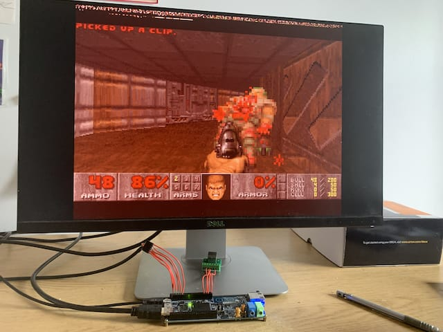

# Doomgeneric

This folder contains files unique to the MINA32 port of Doomgeneric. To compile this port, you'll need a copy of Doomgeneric from the official [Github repository](https://github.com/ozkl/doomgeneric), as well as a WAD file containing game data (only the shareware release [doom1.wad](https://www.wad-archive.com/wad/Doom-Shareware-v1.9) has been tested).

1. Convert the WAD to a header file, using e.g. `xxd -i doom1.wad > doom1_wad.h`.
2. Copy `doom1_wad.h` and the files in this folder to `/doomgeneric/doomgeneric`, overwriting the originals.
3. Run `make` and load the resulting `doom.hex` over UART using `sw/load_hex.py` as usual.

